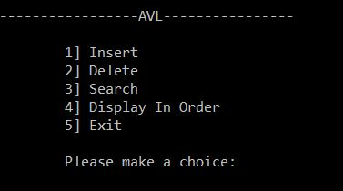

# Overwiew

This is an AVL Tree in C `Pointer to Pointer` implementation. It is meant to help for ~school~ self-balancing tree programming projects.

_AVL Balance Property_: at every node X, the height of the left subtree differs from the height of the right subtree by at most 1.

This implementation is recursive.

# Functions

Operations supported by AVL Tree `Pointer to Pointer` Implementation.

- Search
- Insert
- Delete
- Display (in-order)



# Data Structures
```C
typedef struct avlNode {
	struct avlNode* left;
	struct avlNode* right;
	int key;
	int height;
}*avl;
```
# Files

- AVL TREE.pptx: dowload to view the animations of this code
- AVLtree.c: actual code
- UI.jpg: console UI/Menu


